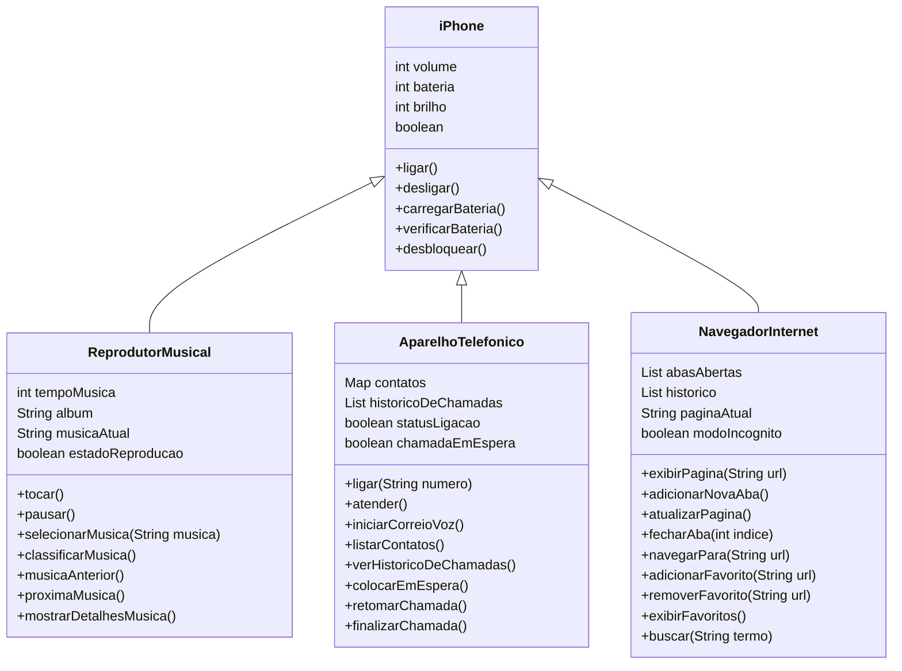

## Autores
- [Lucca Maia](https://github.com/scriptedgrain)

## POO - Desafio

### Meu Diagrama UML (Mermaid)

```mermaid
classDiagram
    iPhone <|-- ReprodutorMusical
    iPhone <|-- AparelhoTelefonico
    iPhone <|-- NavegadorInternet
    class iPhone {
      int volume
      int bateria
      int brilho
      boolean 
      +ligar()
      +desligar()
      +carregarBateria()
      +verificarBateria()
      +desbloquear()
    }
    class ReprodutorMusical {
      int tempoMusica
      String album
      String musicaAtual
      boolean estadoReproducao

      +tocar()
      +pausar()
      +selecionarMusica(String musica)
      +classificarMusica()
      +musicaAnterior()
      +proximaMusica()
      +mostrarDetalhesMusica()
    }
    class AparelhoTelefonico{
      Map<String, String> contatos
      List<String> historicoDeChamadas
      boolean statusLigacao
      boolean chamadaEmEspera

      +ligar(String numero)
      +atender()
      +iniciarCorreioVoz()
      +listarContatos()
      +verHistoricoDeChamadas()
      +colocarEmEspera()
      +retomarChamada()
      +finalizarChamada()
    }
    class NavegadorInternet{
      List<String> abasAbertas  
      List<String> historico
      String paginaAtual
      boolean modoIncognito

      +exibirPagina(String url)
      +adicionarNovaAba()
      +atualizarPagina()
      +fecharAba(int indice)
      +navegarPara(String url)
      +adicionarFavorito(String url)
      +removerFavorito(String url)
      +exibirFavoritos()
      +buscar(String termo)
    }
```